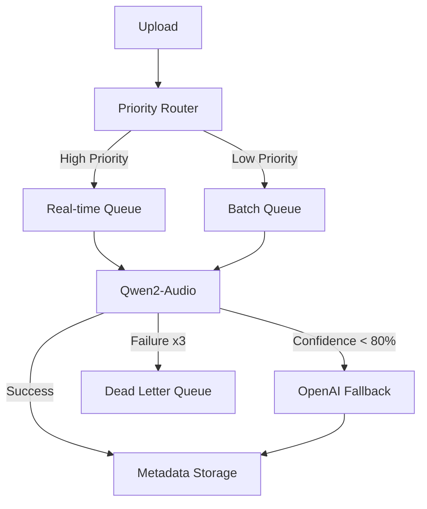

### **Product Requirements Document (PRD)**  
**Project Name**: Metadata Tool for Music Catalogs  

## **1. Introduction**  

### **1.1 Purpose**  
The Metadata Tool for Music Catalogs is designed to provide **labels, distributors, and rights holders** with a **high-performance, AI-driven** solution for managing and enriching music metadata.  

The tool will enable users to:  
- **Drag and drop** audio files for **automated metadata extraction**.  
- **Edit metadata manually or in bulk** through an intuitive UI.  
- **Access metadata via API** for large-scale processing and enrichment.  
- **Enhance metadata with AI** for **genre classification, mood tagging, BPM detection, and key analysis**.  
- **Ensure compliance with industry standards** (DDEX, CWR, ISRC, ISWC).  
- **Batch process metadata** efficiently, including validation and exports.  

### **1.2 Goals and Objectives**  
- **Backend**: High-performance, scalable metadata extraction using **Golang**.  
- **Frontend**: **React-based UI** with an intuitive user experience.  
- **API-First**: GraphQL & RESTful API for **metadata retrieval, validation, and bulk processing**.  
- **AI Enhancement**: AI-powered **metadata enrichment** with model versioning & cost optimization.  
- **Compliance**: Full **DDEX ERN 4.3 support**, ensuring metadata standardization.  
- **Batch Processing**: Bulk metadata imports, edits, and exports at scale.  

---

## **2. Features & Requirements**  

### **2.1 Core Features**  

#### **Metadata Extraction & AI Processing**  
- **Primary AI Model: Qwen2-Audio**
  - Self-hosted solution for cost-effectiveness
  - Real-time processing for Enterprise tier
  - Confidence threshold: 80%
  - Automatic fallback to OpenAI when needed
  
- **Fallback AI Model: OpenAI**
  - Used when Qwen2 confidence < 80%
  - Used during system degradation
  - Cost-optimized usage patterns
  
- **A/B Testing Infrastructure**
  - 90/10 traffic split for model comparison
  - Real-time performance monitoring
  - BigQuery analytics integration

#### **Queue System (Google Pub/Sub)**
- **High Priority Queue**
  - Real-time processing (<1s latency)
  - Enterprise tier requests
  - Automatic scaling
  
- **Low Priority Queue**
  - Batch processing (<10min processing)
  - Free/Pro tier requests
  - Cost-optimized processing

#### **File Management & Retention**
- **Tier-based Retention**
  - Free Tier: 30 days
  - Pro Tier: 6 months
  - Enterprise: Custom retention policies
  
- **Cleanup Process**
  - 7-day deletion notifications
  - Extension options for Enterprise
  - Temporary file management (24h)

#### **API Integration**  
- **GraphQL & REST API** for metadata retrieval, validation, and enrichment.
- OAuth2 authentication with JWT-based access control.
- Rate limiting based on subscription tier.

#### **Batch Processing & Editing**  
- **Bulk metadata imports** with validation and enrichment.
- **CSV, JSON, XML exports** for DSP compatibility.
- **Pre-validation of metadata** against DDEX standards before submission.

#### **User Authentication & Permissions**  
- **Role-based access control (RBAC)**:  
  - **Admin**: Full system control, user management, system settings.  
  - **Label User**: Upload, edit, and export metadata.  
  - **API User**: Programmatic access for automation, subject to API limits.  

---

## **3. Technical Architecture**  

### **3.1 Backend (Golang)**  
- **Framework**: Go Fiber for high-performance HTTP handling.  
- **Database**: PostgreSQL (with **partitioning for large-scale metadata storage**).  
- **Queue System**: Google Pub/Sub for reliable message processing.
- **Analytics**: BigQuery for A/B testing and performance analysis.
- **Storage**: Cloud Storage (S3-compatible) for audio and metadata logs.  
- **Authentication**: OAuth2 with JWT-based session management.  
- **API Documentation**: OpenAPI (Swagger) for REST and GraphQL Playground for flexible queries.  

#### **Metadata Processing Pipeline**  

---

### **3.2 Frontend (React & TypeScript)**  
- **Framework**: React with Next.js for SSR support.  
- **State Management**: TanStack Query for API state handling.  
- **Validation**: Zod for form validation.  
- **Styling**: Tailwind CSS for responsive UI.  
- **Testing**: Jest & React Testing Library for unit and integration testing.  

---

## **4. AI Model Integration & Scaling**  

### **4.1 AI-Powered Metadata Processing**  
- **Primary Model: Qwen2-Audio**
  - Self-hosted for cost optimization
  - Real-time processing capability
  - Confidence threshold: 80%
  
- **Fallback Model: OpenAI**
  - Used when Qwen2 confidence < 80%
  - Cost-optimized usage patterns
  - Automatic failover support

### **4.2 A/B Testing & Optimization**
- 90/10 traffic split between models
- Real-time performance monitoring
- BigQuery analytics integration
- Automatic model selection based on performance

---

## **5. Service Splitting & Scalability**  

### **5.1 Service Architecture**  
- **Split microservices when exceeding 500M records or 10,000 QPS**.  
- **DDEX ingestion, AI processing, and Metadata API run as separate services**.  

### **5.2 Database & Sharding Strategy**  
- **Partner-based sharding** (Sony, Warner, Universal).  
- **PostgreSQL partitioned tables** for large-scale queries.  
- **Migrate to Cloud Spanner if writes exceed 5,000 TPS**.  

### **5.3 Caching Strategy**  
- **Redis clustering** for metadata caching.  
- **Pre-warming**: Pre-load top 10K metadata records in cache before peak traffic.  
- **Probabilistic cache refresh** to prevent TTL stampedes.  

---

## **6. Compliance & Security**  

### **6.1 DDEX Schema Versioning**  
- **Dual-write migration strategy** ensures backward compatibility.  
- **Pre-validation against latest ERN schema before submission**.  

### **6.2 GDPR & Data Protection**  
- **Soft-delete metadata upon user request** for compliance.  
- **Territorial metadata access controls** based on licensing rules.  
- **Audit logging** for metadata changes, retained for:  
  - **7 years (DDEX compliance)**  
  - **3 years (AI metadata logs)**  
  - **6 months (low-risk operational logs)**  

---

## **7. Monitoring & Observability**

### **7.1 Metrics & Dashboards**
- **AI Processing Metrics**
  - Response time by model
  - Confidence score distribution
  - Error rates and types
  - Cost per request
  
- **Queue Metrics**
  - Queue size by priority
  - Processing time
  - Error rates
  - DLQ statistics

### **7.2 Alerting**
- **AI Processing Alerts**
  - Confidence score < 70% for >20% of requests
  - Processing time > SLA
  - Error rate > 5%
  
- **Queue Alerts**
  - Queue size > 500 pending jobs
  - DLQ size > 100 messages
  - Processing delay > 10 minutes

---

## **8. Deployment & CI/CD**  

### **8.1 Cloud Infrastructure (Google Cloud Platform)**  
- **Compute**: Cloud Run for queue processors, Cloud Functions for cleanup
- **Queue**: Pub/Sub for reliable message processing
- **Storage**: Cloud Storage, Cloud SQL, Redis
- **Analytics**: BigQuery for A/B testing
- **Security**: Cloud IAM, Secret Manager

### **8.2 CI/CD Pipeline**  
- **Cloud Build** for automated testing & deployment.  
- **Artifact Registry** for managing Docker containers.  
- **Staging & Production environments** with feature flags for safe rollouts.  

---

## **9. Future Enhancements**  

- **Multi-region AI Processing**
- **Enhanced A/B Testing Framework**
- **Custom Model Training Pipeline**
- **Advanced Batch Processing**
- **Global Load Balancing**
- **Cross-region Replication**

