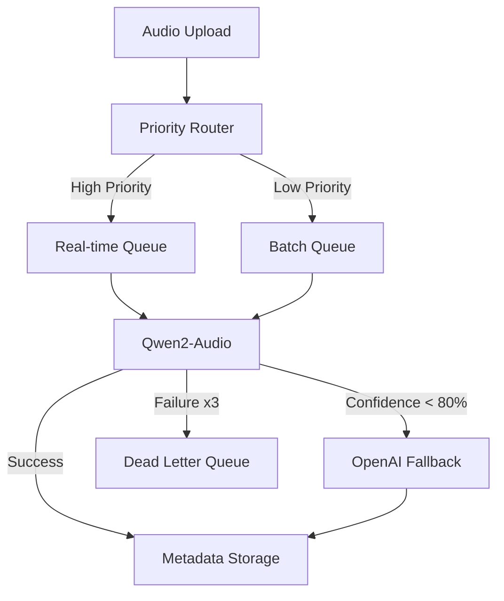

# AI Processing Architecture

## Overview

The metadata tool implements a robust AI processing system using a combination of Qwen2-Audio (primary) and OpenAI (fallback) models, orchestrated through Google Cloud Platform services.

## Core Components

### 1. Queue System (Google Pub/Sub)

#### Priority Queues
- **High Priority Queue**
  - Real-time API requests
  - Target latency: <1s
  - Used by Enterprise tier customers
  
- **Low Priority Queue**
  - Batch processing requests
  - Target processing time: <10 minutes
  - Used for bulk uploads and free tier processing

#### Dead Letter Queue (DLQ)
- Handles failed processing attempts
- Maximum retries: 3
- Retention period: 7 days
- Manual intervention triggers
- Failure analytics and monitoring

### 2. AI Model Integration

#### Primary: Qwen2-Audio
- Self-hosted solution
- Real-time processing capability
- Confidence threshold: 80%
- Metrics tracking:
  - Inference speed
  - Confidence scores
  - Error rates

#### Fallback: OpenAI
- Triggered when:
  - Qwen2 confidence < 80%
  - Qwen2 processing failure
  - System degradation
- Cost optimization through selective usage

### 3. A/B Testing Infrastructure

#### Test Configuration
- 90% traffic to primary model
- 10% traffic to experimental model
- Metrics stored in BigQuery
- Real-time performance comparison

#### Metrics Tracked
- Inference speed
- Confidence scores
- Error rates
- Cost per request
- Processing success rate

### 4. File Retention Policies

#### Tier-based Retention
- Free Tier: 30 days
- Pro Tier: 6 months
- Enterprise: Configurable per customer

#### Cleanup Process
- Automated cleanup system
- 7-day advance notification
- Extension options for Enterprise users
- Temporary file management (24-hour retention)

## Processing Flow

## Monitoring & Observability

### Prometheus Metrics
- AI response time
- Queue size
- Processing success rate
- Confidence score distribution
- Error rates by type

### Alert Conditions
- Confidence score < 70% for >20% of requests
- Queue size > 500 pending jobs
- Processing time > SLA
- Error rate > 5%

### Dashboards
- Real-time processing metrics
- A/B test comparisons
- Queue health monitoring
- Cost analysis

## Scaling Strategy

### Queue Processing
- Auto-scaling based on queue size
- Separate scaling policies for high/low priority
- Regional deployment for latency optimization

### AI Processing
- Horizontal scaling of Qwen2 instances
- Load balancing across processing nodes
- Automatic failover to OpenAI

## Cost Optimization

### Processing Strategies
- Batch processing for non-urgent requests
- Selective use of OpenAI fallback
- Caching of common results
- Resource auto-scaling

### Storage Optimization
- Tiered storage classes
- Automatic cleanup of temporary files
- Compression for long-term storage

## Security & Compliance

### Data Protection
- Encryption at rest and in transit
- Access control based on subscription tier
- Audit logging of all operations

### Compliance
- GDPR-compliant data handling
- Configurable retention policies
- Data residency options for Enterprise

## Future Enhancements

### Planned Features
- Multi-region processing
- Enhanced A/B testing framework
- Custom model training pipeline
- Advanced batch processing optimizations

### Scalability Improvements
- Global load balancing
- Cross-region replication
- Enhanced caching strategies
- Predictive auto-scaling 