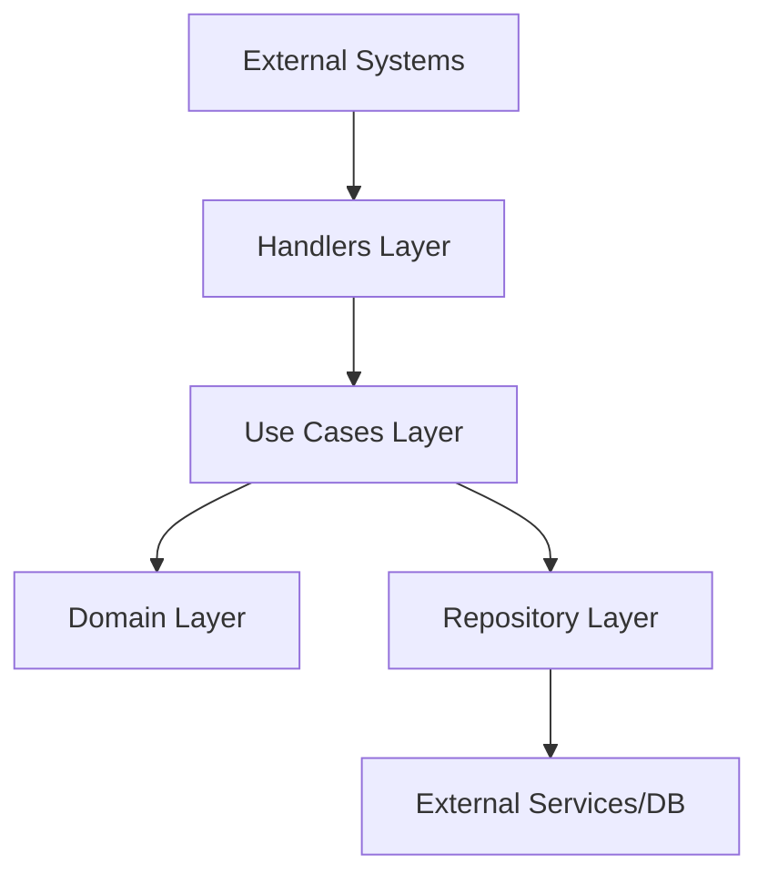
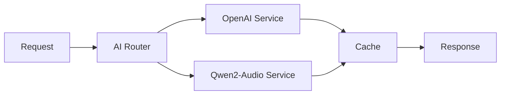
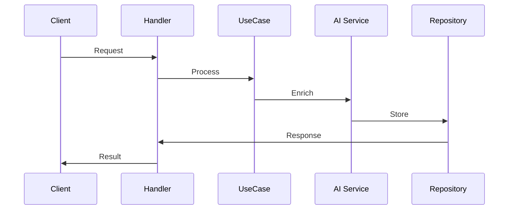

# Architecture Overview

## System Architecture

The Metadata Tool follows Clean Architecture principles, organizing code into concentric layers with clear separation of concerns.



## Core Layers

### 1. Domain Layer
- Contains business entities and interfaces
- Framework-independent
- Pure business logic

```plaintext
domain/
├── ai/
│   ├── service.go     # AI service interfaces
│   ├── types.go       # Shared AI types
│   └── models.go      # AI domain models
├── track/
│   ├── entity.go      # Track entity
│   └── repository.go  # Track repository interface
└── audio/
    └── service.go     # Audio processing interface
```

### 2. Use Cases Layer
- Application-specific business rules
- Orchestrates domain entities
- Independent of external concerns

```plaintext
usecase/
├── ai/
│   ├── enrichment.go
│   ├── validation.go
│   └── batch_processing.go
├── track/
│   └── management.go
└── audio/
    └── processing.go
```

### 3. Repository Layer
- Data access implementation
- External service integration
- Caching logic

```plaintext
repository/
├── ai/
│   ├── openai/
│   ├── qwen/
│   └── composite/
├── storage/
└── cached/
```

### 4. Handlers Layer
- HTTP/API endpoints
- Request/Response handling
- Input validation

## Key Components

### AI Services Integration


### Data Flow


## Infrastructure Components

### 1. Monitoring Stack
- Prometheus metrics
- Grafana dashboards
- Custom AI performance metrics

### 2. Caching Strategy
- Redis for hot data
- Tiered caching approach
- Cache invalidation rules

### 3. Storage
- S3-compatible object storage
- Regional routing
- Access patterns optimization

## Security Architecture

### 1. Authentication
- JWT-based auth
- API key management
- Role-based access control

### 2. Data Protection
- Encryption at rest
- Secure communication
- Audit logging

## Scalability Considerations

### 1. Horizontal Scaling
- Stateless services
- Distributed caching
- Load balancing

### 2. Performance Optimization
- Batch processing
- Async operations
- Resource pooling

## Error Handling

### 1. Error Categories
```plaintext
- ValidationError
- BusinessError
- TechnicalError
- IntegrationError
```

### 2. Recovery Strategies
- Retry policies
- Circuit breakers
- Fallback mechanisms

## Configuration Management

### 1. Environment Configuration
```plaintext
- Development
- Staging
- Production
```

### 2. Feature Flags
- AI model selection
- Caching strategies
- Performance tuning

## Monitoring and Observability

### 1. Key Metrics
- Response times
- Error rates
- Resource utilization

### 2. Logging Strategy
- Structured logging
- Log levels
- Correlation IDs

## Integration Points

### 1. External Services
- OpenAI API
- Qwen2-Audio
- Storage services

### 2. Internal Services
- Authentication
- Caching
- Monitoring

## Deployment Architecture

### 1. Container Strategy
```plaintext
- Application containers
- Sidecar patterns
- Resource limits
```

### 2. Network Architecture
- Service mesh
- Load balancing
- Security groups

## Future Considerations

### 1. Planned Improvements
- Enhanced AI capabilities
- Advanced caching
- Performance optimization

### 2. Scalability Roadmap
- Regional deployment
- Multi-cloud support
- Enhanced monitoring 