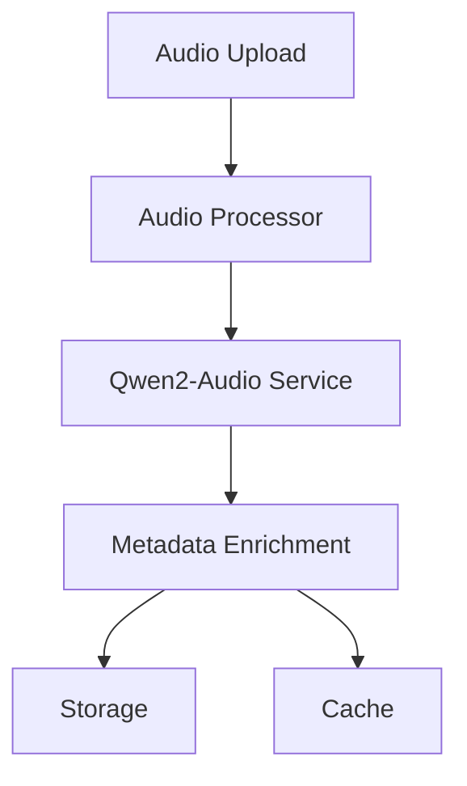

# Qwen2-Audio Integration

## Overview

This document details the integration of Qwen2-Audio with our metadata tool, including architecture, implementation details, and best practices.

## Table of Contents

1. [Architecture](#architecture)
2. [Configuration](#configuration)
3. [Implementation](#implementation)
4. [Deployment](#deployment)
5. [Monitoring](#monitoring)
6. [Troubleshooting](#troubleshooting)

## Architecture

### Component Integration


### Service Structure
```plaintext
qwen2-audio/
├── service/
│   ├── client.go       # Qwen2-Audio client
│   ├── processor.go    # Audio processing
│   └── mapper.go       # Data mapping
├── config/
│   └── settings.go     # Configuration
└── models/
    └── types.go        # Domain models
```

## Configuration

### Environment Variables
```yaml
QWEN_API_KEY: "your-api-key"
QWEN_MODEL_VERSION: "latest"
QWEN_ENDPOINT: "https://api.qwen.ai/v1"
QWEN_BATCH_SIZE: 10
QWEN_TIMEOUT: "30s"
QWEN_MAX_RETRIES: 3
```

### Model Settings
```json
{
  "audio_analysis": {
    "confidence_threshold": 0.85,
    "min_duration": "5s",
    "max_duration": "300s"
  },
  "speech_recognition": {
    "language": ["en", "es", "fr"],
    "model": "qwen2-audio-large"
  }
}
```

## Implementation

### Service Interface
```go
type Qwen2AudioService interface {
    AnalyzeAudio(ctx context.Context, data []byte) (*AudioAnalysis, error)
    ExtractSpeech(ctx context.Context, data []byte) (*Transcript, error)
    ClassifySound(ctx context.Context, data []byte) (*Classification, error)
    BatchProcess(ctx context.Context, files [][]byte) ([]*AudioAnalysis, error)
}
```

### Error Handling
```go
type QwenError struct {
    Code        string
    Message     string
    RetryCount  int
    Recoverable bool
}
```

### Retry Strategy
```plaintext
1. Exponential backoff
2. Maximum 3 retries
3. Circuit breaker pattern
4. Fallback to OpenAI
```

## Deployment

### Prerequisites
- Go 1.21+
- Redis 6.0+
- PostgreSQL 13+
- S3-compatible storage

### Resource Requirements
```yaml
compute:
  cpu: "2 cores"
  memory: "4 GB"
  storage: "20 GB"
network:
  bandwidth: "100 Mbps"
  latency: "<100ms"
```

### Security Requirements
- TLS 1.3
- API key rotation
- Rate limiting
- IP whitelisting

## Monitoring

### Metrics
```plaintext
1. Response Times
   - p95 latency
   - Average processing time
   - Queue length

2. Quality Metrics
   - Confidence scores
   - Error rates
   - Fallback rates

3. Resource Usage
   - API calls
   - Memory usage
   - Network bandwidth
```

### Alerting Rules
```yaml
alerts:
  - name: HighErrorRate
    condition: error_rate > 0.05
    duration: 5m
    severity: critical

  - name: LowConfidence
    condition: confidence_score < 0.8
    duration: 10m
    severity: warning

  - name: HighLatency
    condition: p95_latency > 2s
    duration: 5m
    severity: warning
```

## Troubleshooting

### Common Issues

1. **Connection Errors**
   ```plaintext
   - Check network connectivity
   - Verify API credentials
   - Confirm endpoint availability
   ```

2. **Processing Errors**
   ```plaintext
   - Validate input format
   - Check file size limits
   - Verify model availability
   ```

3. **Performance Issues**
   ```plaintext
   - Monitor resource usage
   - Check batch sizes
   - Verify cache hit rates
   ```

### Debug Tools
```plaintext
1. Health Checks
   - /health/qwen
   - /metrics/qwen
   - /status/qwen

2. Logging
   - Structured JSON logs
   - Correlation IDs
   - Error tracking
```

## Best Practices

### Audio Processing
```plaintext
1. Pre-processing
   - Format validation
   - Size optimization
   - Quality checks

2. Batch Processing
   - Optimal batch size
   - Queue management
   - Error handling
```

### Performance Optimization
```plaintext
1. Caching Strategy
   - Results caching
   - Model caching
   - Configuration caching

2. Resource Management
   - Connection pooling
   - Memory management
   - Garbage collection
```

### Security
```plaintext
1. API Security
   - Key management
   - Request signing
   - Rate limiting

2. Data Protection
   - Encryption
   - Access control
   - Audit logging
```

## Version History

### Current Version: 1.0.0
```plaintext
- Initial integration
- Basic audio analysis
- Speech recognition
- Sound classification
```

### Planned Updates
```plaintext
1.1.0:
- Enhanced batch processing
- Advanced caching
- Performance improvements

1.2.0:
- Multi-language support
- Custom model training
- Advanced analytics
```

## Support

### Contact Information
```plaintext
- Technical Support: support@qwen.ai
- Documentation: docs.qwen.ai
- Community: community.qwen.ai
```

### Additional Resources
- [API Documentation](https://api.qwen.ai/docs)
- [Model Documentation](https://docs.qwen.ai/models)
- [Best Practices Guide](https://docs.qwen.ai/best-practices) 